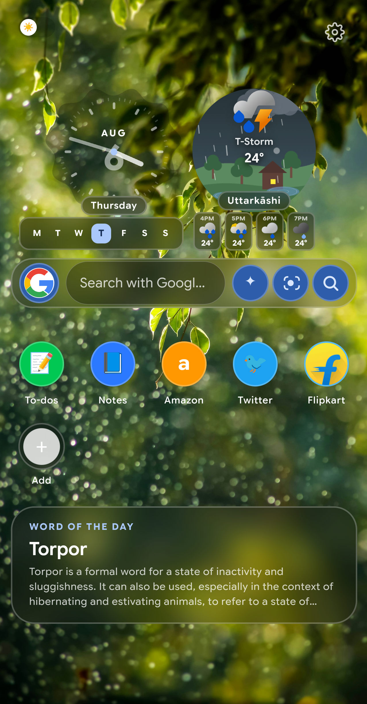
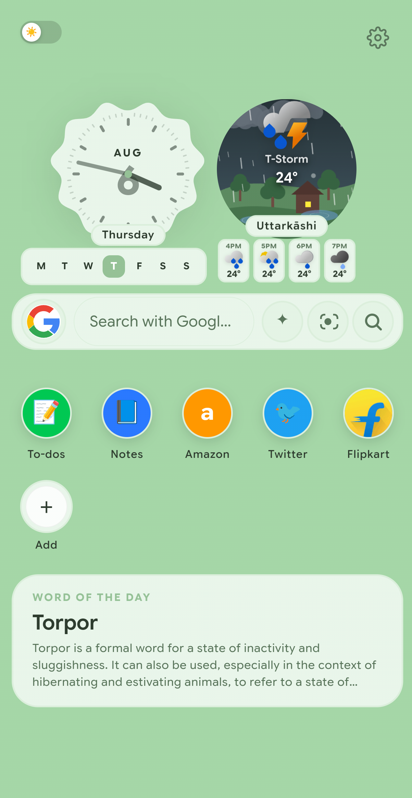
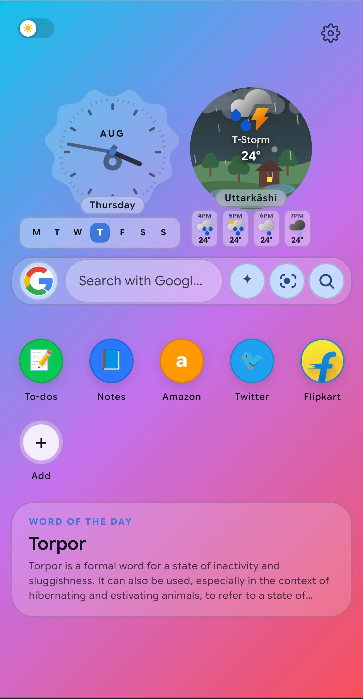

# Zero New Tab Page

A sleek, minimal, and highly functional custom New Tab page extension for Google Chrome. Designed to eliminate clutter while keeping essential web tools, weather, and daily insights right at your fingertips.

## 📸 Screenshots

  
    
  
    
  

## ✨ Features

### 🔍 Search & AI Features
*   **Dual Search Engine & Quick Switch:** Easily swap between different search engines on the fly. Enable two active search engines side-by-side in the search bar for lightning-fast switching without opening the menu.
*   **Consistent Search Layout:** The search logo size is engineered to remain perfectly constant and unified, completely independent of which search provider you actively switch to.
*   **Quick Engine Switching:** Tap the search engine logo inside the search bar to instantly open a grid and switch between 11 built-in search engines (Google, DuckDuckGo, Yandex, Bing, Yahoo, Brave, Startpage, Perplexity, Ecosia, Ocean, Baidu).
*   **Custom Search Engines:** Add your own custom search providers using a simple `%s` URL format.
*   **Live Suggestions:** Real-time search autocomplete suggestions powered by Google as you type.
*   **Auto-Search:** An optional toggle that instantly executes the search the moment you tap a suggestion.
*   **Google Lens & Gemini Integration:** Dedicated quick-action buttons for Google Lens (image upload/search) and Gemini AI queries (these appear automatically when Google is your active engine).

### 🌤️ Smart Widgets
*   **Time & Date Display:** A clean, stylish clock and calendar view to keep you anchored throughout your day. Includes an interactive date blob and an optional animated analog clock overlay.
*   **Live Weather Updates:** Real-time, localized weather conditions integrated seamlessly into your dashboard. Fetches real-time data via the Open-Meteo API, displaying current temperatures, text conditions, dynamic icons, and a 4-hour forecast strip.
*   **Scenic Animated Weather Canvas:** A highly dynamic background inside the weather widget that reacts to the forecast. It features sun/moon trajectories based on local time, rain with splashing puddles, lightning flashes for storms, fireflies at night, and season-aware foliage (spring flowers, autumn leaves). It even features a small character that pulls out an umbrella when it rains!
*   **Word of the Day:** Expand your vocabulary directly from your new tab. Automatically scrapes the daily word and definition from Merriam-Webster.
*   **Widget Alignment:** Flexible layout controls to snap your widgets to the left, center, or right of the screen.

### 🚀 Shortcuts & Grid System
*   **Drag-and-Drop Grid:** Long-press any shortcut to enter "edit mode" (the icons will wiggle) and drag them around to rearrange your layout.
*   **Customization:** Add custom websites. The extension automatically fetches high-resolution favicons and assigns a complementary background color to the icon ring.
*   **Minimalist Mode:** A one-tap toggle that completely hides the shortcut grid and widgets for a distraction-free, ultra-clean workspace.

### 🎨 Personalization & Aesthetics
*   **Minimalist Customization:** Deeply personalize your layout and preferences while maintaining a zero-clutter, distraction-free environment.
*   **Material Design 3 (MD3):** A modern, fluid design system with dynamic hover states, ripple animations, and high-quality typography (Google Sans Flex).
*   **Dynamic Theming:** The UI contrast, text colors, and widget containers automatically adapt based on your background brightness or OS-level dark/light mode.
*   **Dark Overlay:** A top-left toggle (☀️/🌙) that applies a stylish dark overlay to any bright wallpaper, instantly making text easier to read.
*   **Background Options:**
    *   **Solid & Gradients:** A massive built-in grid of preset solid colors and modern linear gradients.
    *   **Custom Hex Picker:** A visual HSV color picker to dial in the exact background hex code you want.
    *   **Wallpaper Center:** A gallery of high-quality Unsplash wallpapers, plus a file upload button to use your own local images (automatically compressed and scaled to 1080p to save storage).
    *   **Weather Wallpaper Mode:** Automatically shifts the entire browser background to match the live weather conditions outside.
*   **Layout Sliders:** Deep customization sliders to adjust Search Bar Width, Height, Vertical/Horizontal Position, Search Bar Roundness, Icon Roundness, and total UI Transparency.

### 🌐 Web Navigation & Floating Toolbar
*   **Floating Toolbar UI:** A beautifully designed, unobtrusive floating toolbar that provides quick access to your most-used features and customization settings without eating up valuable screen space.
*   **Injectable Toolbar:** Persists across the web pages you visit, giving you touch-friendly access to core browser functions.
*   **Toolbar Controls:** Back, Forward, Reload, History, Downloads, and New Window creation.
*   **Orientation Toggle:** Switch the floating toolbar between a horizontal bottom bar and a vertical sidebar layout.

### 💾 Data & Backup Management
*   **Offline Caching:** Caches high-res favicons and weather data so your new tab loads instantly without waiting for network requests.
*   **Startup Repair:** A background service worker that silently sweeps for broken "ghost" tabs when the browser restarts and forces them to load your custom UI.
*   **Full Backup & Restore:** Generate a downloadable `.json` file that perfectly saves your `localStorage` (colors, sliders, toggles) and your `chrome.storage.local` (shortcuts, custom engines). Upload the file later to instantly restore your exact setup.
*   **Reset Controls:** Dedicated buttons to safely reset just your shortcuts, just your background, or just your layout sliders back to factory defaults.

## 🚀 Installation Guide

Because this extension is currently in active development and not yet on the Chrome Web Store, you can easily install it on your local browser using Developer Mode.
 
---

## 👏 Credits & APIs

This extension is built on top of some fantastic open APIs. Huge thanks to the following services:
*   **[Open-Meteo](https://open-meteo.com/):** For providing the incredibly fast and reliable live weather data.
*   **[Merriam-Webster](https://dictionaryapi.com/):** For powering the Word of the Day feature with robust dictionary insights.

## 🛠️ Built With
*   HTML / CSS / JavaScript
*   Manifest V3
*   Node.js (crx3 packaging)
*   GitHub Actions
